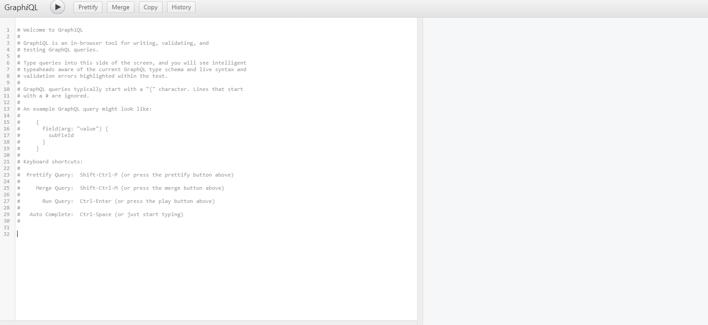
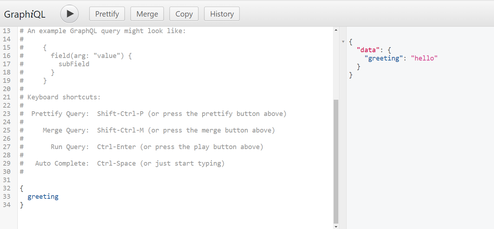
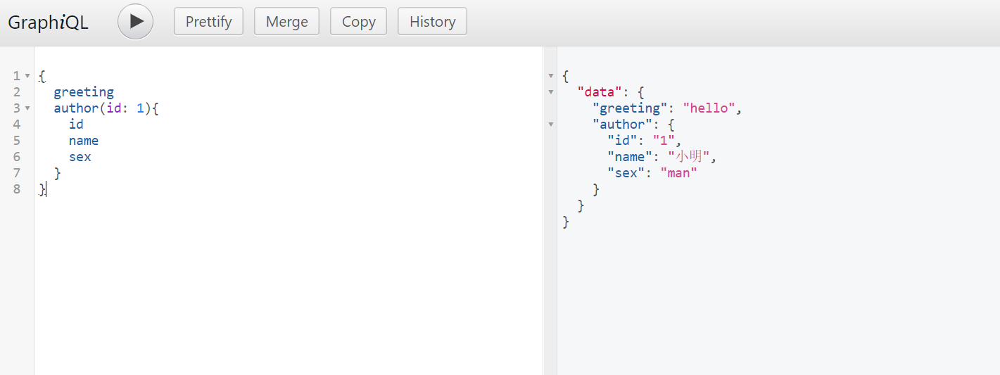
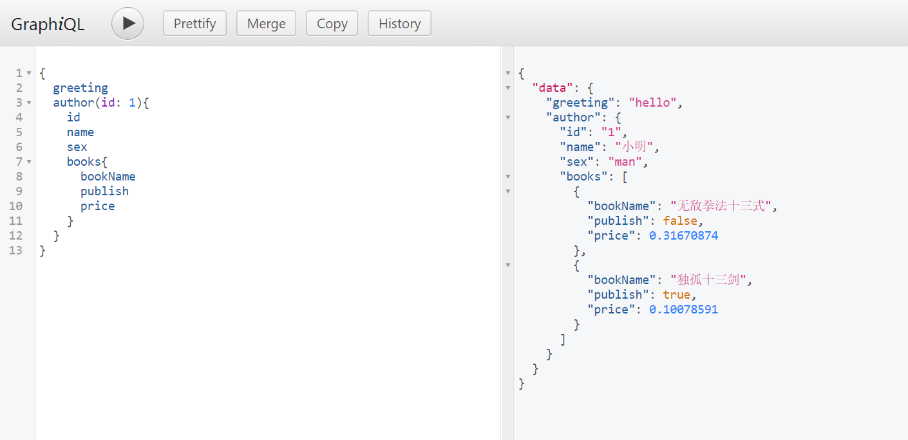

# Spring GraphQL初体验

`GraphQL `是一个用于API的查询语言，通过`GraphQL `可以实现按需获取数据。最近Spring发布了`Spring GraphQL`项目，将GraphQL和Spring结合在一起，可以通过`Spring Boot`的方式使用`GraphQL`

## 引入依赖

~~~xml
	<dependencies>
		<dependency>
			<groupId>org.springframework.experimental</groupId>
			<artifactId>graphql-spring-boot-starter</artifactId>
			<version>1.0.0-SNAPSHOT</version>
		</dependency>
		<dependency>
			<groupId>org.springframework.boot</groupId>
			<artifactId>spring-boot-starter</artifactId>
		</dependency>
		<dependency>
			<groupId>org.springframework.boot</groupId>
			<artifactId>spring-boot-starter-web</artifactId>
		</dependency>
		<dependency>
			<groupId>org.springframework.boot</groupId>
			<artifactId>spring-boot-devtools</artifactId>
			<scope>runtime</scope>
			<optional>true</optional>
		</dependency>
		<dependency>
			<groupId>org.springframework.boot</groupId>
			<artifactId>spring-boot-configuration-processor</artifactId>
			<optional>true</optional>
		</dependency>
		<dependency>
			<groupId>org.projectlombok</groupId>
			<artifactId>lombok</artifactId>
			<optional>true</optional>
		</dependency>
	</dependencies>

	<repositories>
		<repository>
			<id>spring-milestones</id>
			<name>Spring Milestones</name>
			<url>https://repo.spring.io/milestone</url>
		</repository>
		<repository>
			<id>spring-snapshots</id>
			<name>Spring Snapshots</name>
			<url>https://repo.spring.io/snapshot</url>
			<snapshots>
				<enabled>true</enabled>
			</snapshots>
		</repository>
	</repositories>
~~~

## 编写yml配置文件

```yaml
server:
  port: 8888
spring:
  graphql:
    schema:
      printer:
        enabled: true
    locations: /graphql  # 指定schema文件的位置， 默认在resources下的graphql文件夹下
```

## 编写schema

`schema`: 定义数据结构、类型和关系，在`schema`中定义的`type`和Java中的实体相对应

`type`: 对应Java中的实体对象

`type Query`: 定义查询，在查询时需要按照`Query`中的定义进行查询，不用映射成java对象，`系统中必须存在`

在resources/graphql目录下创建`schema.graphqls`文件，并写入如下内容：

```js
# 定义查询
type Query {
    greeting: String
    author(id: ID!): Author
}

# 定义Author，和java中Author对象对应
type Author {
    id: ID!
    name: String!
    sex: SexEnum
    books: [Book]
}

# 定义Book，和java中Book对象对应
type Book {
    bookName: String!
    publish: Boolean!
    price: Float
}

# 定义枚举，和java中SexEnum对应
enum SexEnum {
    man,
    woman
}
```

## 编写实体类

实体类和`schema`中`type`定义的属性一致

```java
@Data
public class Author {

	private Integer id;

	private String name;

	private SexEnum sex;

	private List<Book> books;
}


@Data
public class Book {

	private String bookName;

	private boolean publish;

	private float price;
}

public enum SexEnum {

    man, woman;
}
```

## 编写查询

```java
@Component
public class CustomizeRuntimeWiring implements RuntimeWiringBuilderCustomizer {

    @Override
    public void customize(RuntimeWiring.Builder builder) {
        
        builder.type("Query", typeWiring -> {
            
            // 查询greeting,返回hello
            typeWiring.dataFetcher("greeting", env -> "hello");

            // 查询作者 
            typeWiring.dataFetcher("author", env -> {

                Integer id = Integer.valueOf(env.getArgument("id"));

                Author author = new Author();
                author.setId(id);
                author.setName("小明");
                author.setSex(SexEnum.man);

                Book book1 = new Book();
                book1.setBookName("无敌拳法十三式");
                book1.setPublish(false);
                book1.setPrice(new SecureRandom().nextFloat());

                Book book2 = new Book();
                book2.setBookName("独孤十三剑");
                book2.setPublish(true);
                book2.setPrice(new SecureRandom().nextFloat());

                author.setBooks(Arrays.asList(book1, book2));

                return author;
            });

            return typeWiring;
        });
    }
}
```

## 启动项目查询

项目启动后访问http://localhost:8888/graphiql进入查询页面



### 查询

查询greeting



查询作者信息



查询作者和书籍

