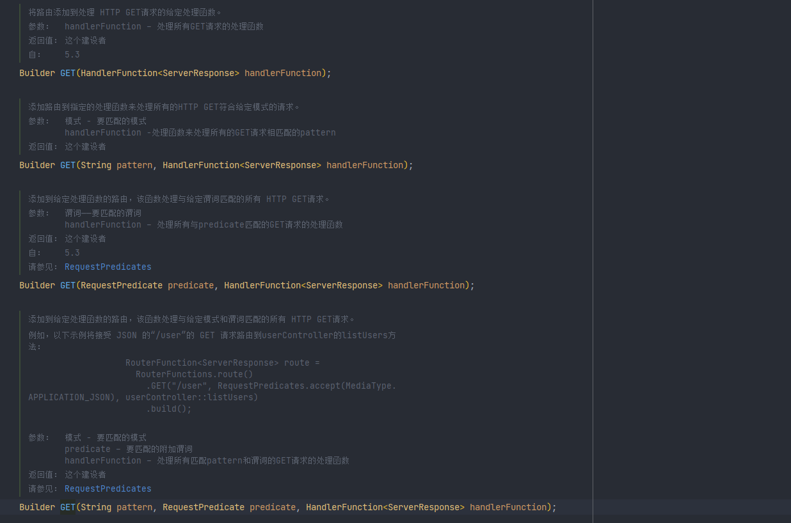

# WebFlux学习笔记

`WebFlux`是一个基于`Reactor`的`异步、非阻塞`的web框架。`WebFlux`可以运行在`Netty`, `Undertow`和`Servlet 3.1以上`的容器中。

> `WebFlux`并不能使接口的响应时间缩短，它仅仅能够提升吞吐量和伸缩性

`WebFlux`提供了两种使用方式：注解式（[Annotated Controllers](https://docs.spring.io/spring-framework/docs/current/reference/html/web-reactive.html#webflux-controller)）和 函数式（[Functional Endpoints](https://docs.spring.io/spring-framework/docs/current/reference/html/web-reactive.html#webflux-fn)）

- 注解式：和`SpringMvc`的注解一致，使用`RestController`、`GetMapping`、`PostMapping`等注解
- 函数式：基于Lambda表达式，使用`Function`描述请求端点

## 注解式（[Annotated Controllers](https://docs.spring.io/spring-framework/docs/current/reference/html/web-reactive.html#webflux-controller)）

和`SpringMvc`的注解一致，使用`RestController`、`GetMapping`、`PostMapping`等注解，支持`Spring validation`参数效验

## 函数式（[Functional Endpoints](https://docs.spring.io/spring-framework/docs/current/reference/html/web-reactive.html#webflux-fn)）

`WebFlux`的函数式使用`Router`和`Handler`处理请求。`RouterFunction`负责接收`HTTP请求`,并找到对应的`HandlerFunction`，`HandlerFunction`处理`HTTP请求`，并返回一个延迟的`ServerResponse`

### HandlerFunction

`HandlerFunction`使用`ServerRequest`和`ServerResponse`处理请求和响应

#### ServerRequest

`ServerRequest`提供了访问HTTP请求的`method`, `URI`, `headers`和 `query parameters`

```java
        // 获取请求的method
        HttpMethod method = serverRequest.method();

        // 获取请求的URI
        URI uri = serverRequest.uri();

        // 获取请求的headers
        ServerRequest.Headers headers = serverRequest.headers();

        // 获取指定key的查询参数
        Optional<String> id = serverRequest.queryParam("id");
        // 获取请求全部的查询参数
        MultiValueMap<String, String> stringStringMultiValueMap = serverRequest.queryParams();

        // 获取请求路径
        RequestPath requestPath = serverRequest.requestPath();
```

##### 提取request body并转成Mono<T>或Flux<T>

```java
// 获取request body并转成Mono<String>
Mono<String> string = serverRequest.bodyToMono(String.class);
//  获取request body并转成Flux<User>
Flux<Person> people = serverRequest.bodyToFlux(User.class);
Mono<String> string = serverRequest.body(BodyExtractors.toMono(String.class));
Flux<Person> people = serverRequest.body(BodyExtractors.toFlux(User.class));

//  获取formData数据
Mono<MultiValueMap<String, String>> map = serverRequest.formData();
//  获取multipartData数据
Mono<MultiValueMap<String, Part>> map1 = serverRequest.multipartData();
//  获取request body数据，并转成Flux<Part>
Flux<Part> parts = serverRequest.body(BodyExtractors.toParts());
```

#### ServerResponse

`ServerResponse`可以访问HTTP请求的`Response`, 可以使用`builder `模式设置响应状态、响应头和响应体

```java
User user = User.builder()
        .id(1)
        .name("张三")
        .age(18)
        .build();

return ServerResponse.ok().body(user, User.class);
```

#### 使用Lambda表达式构造`HandlerFunction`

```java
HandlerFunction<ServerResponse> helloWorld = request -> ServerResponse.ok().bodyValue("Hello World");
```

### RouterFunction

`RouterFunction`负责为请求找到对应的`HandlerFunction`进行处理

```java
RouterFunction<ServerResponse> route = RouterFunctions.route()
    .GET("/person/{id}",, handler::getPerson)
    .POST("/person", handler::createPerson)
    .build();
```

#### RequestPredicate（请求断言）

`GET`、`POST`等方法都有用于接受请求断言参数的重载方法。请求方法和路径匹配后,`RequestPredicate`返回true的请求才会被对应的`HandlerFunction`处理



```java
RouterFunction<ServerResponse> route = route()
         // accept限制了该请求的类型是JSON格式
        .GET("/person/{id}", accept(APPLICATION_JSON), handler::getPerson)
        .POST("/person", handler::createPerson)
        .build();
```

#### Nested Routes（嵌套路由）


使用`path`方法可以将多个请求的相同前缀提取出来

```java
RouterFunction<ServerResponse> route = route()
    .path("/person", builder -> builder 
        .GET("/{id}", accept(APPLICATION_JSON), handler::getPerson)
        .POST("/person", handler::createPerson))
    .build();
```

### 参数验证

可以使用`Spring validation`进行参数验证

1. 添加依赖

   ```java
           <dependency>
               <groupId>org.hibernate.validator</groupId>
               <artifactId>hibernate-validator</artifactId>
               <version>6.2.0.Final</version>
           </dependency>
   ```

2. 编写实体的验证器

   ```java
   import org.springframework.validation.Validator;
   
   public class UserValidator implements Validator {
   
       @Override
       public boolean supports(Class<?> aClass) {
           return User.class.equals(aClass);
       }
   
       @Override
       public void validate(Object o, Errors errors) {
   
           ValidationUtils.rejectIfEmpty(errors, "name", "name.empty");
           User user = (User) o;
           if (user.getAge() < 20) {
               errors.rejectValue("age", "negativevalue");
           } else if (user.getAge() > 110) {
               errors.rejectValue("age", "too.darn.old");
           }
       }
   }
   ```

3. 应用参数验证

   ```java
   public Mono<ServerResponse> addUser(ServerRequest serverRequest){
   
       // 在doOnNext方法中绑定验证方法
       serverRequest.bodyToMono(User.class) .doOnNext(this::validate);
   
       return ServerResponse.ok().body("122", String.class);
   }
   
   // 定义验证方法
   private void validate(User user) {
       // 实例化实体验证器
       Validator validator = new UserValidator();
       Errors errors = new BeanPropertyBindingResult(user, "user");
       validator.validate(user, errors);
       if (errors.hasErrors()) {
           throw new ServerWebInputException(errors.toString());
       }
   }
   ```

> Handlers 也可以通过`LocalValidatorFactoryBean`注入一个全局的`Validator`，使用standard bean validation API（JSR-303）验证

